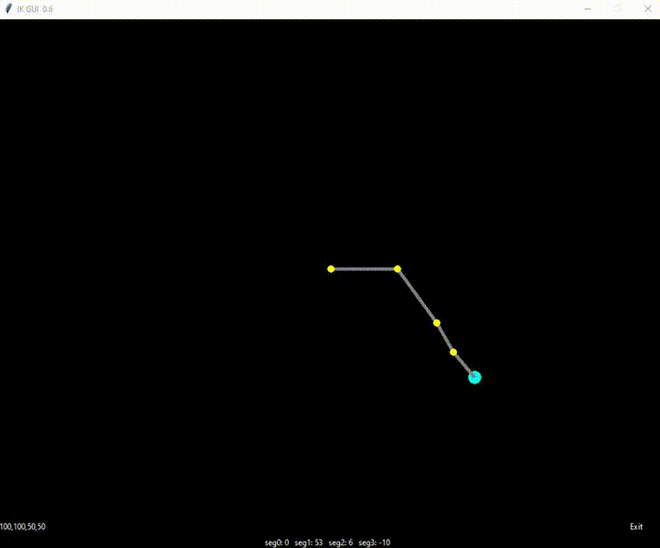

# IK GUI #
by Kai Zhu

Version 0.6

An interactive Forward and Backward Reaching Inverse Kinematic (FABRIK) implementation

### How to use ###

* Click and drag on GUI to move target position
* Use text entry at the bottom of the interface to specify segments (e.g. 100,100,150, creates 2 segments of 100 pixels in length and a final segment of 150px)
* Local joint angles are displayed at the bottom of the window
* Use checkbox to anchor / unanchor IK chain

### To-do ###
* Joint angle constraints